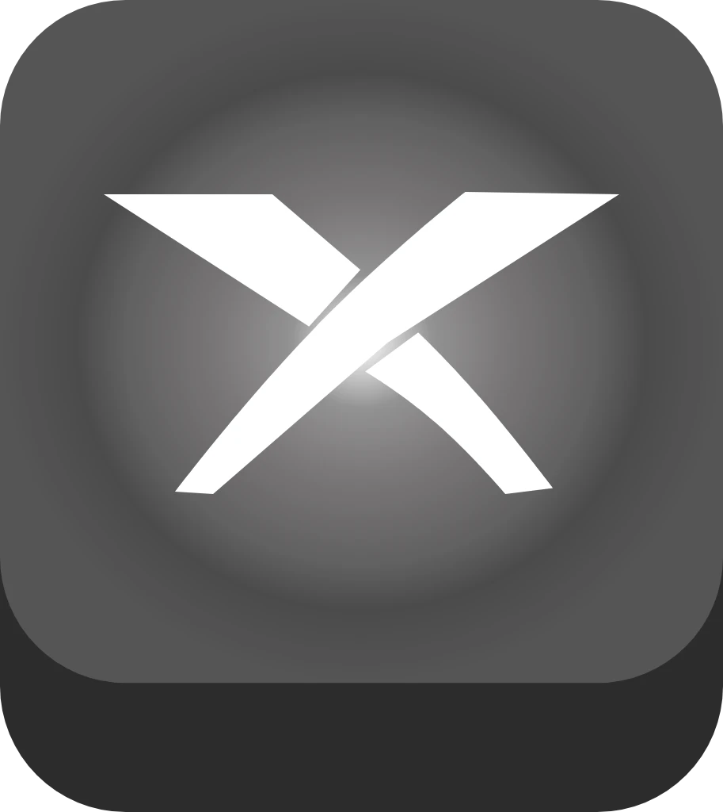
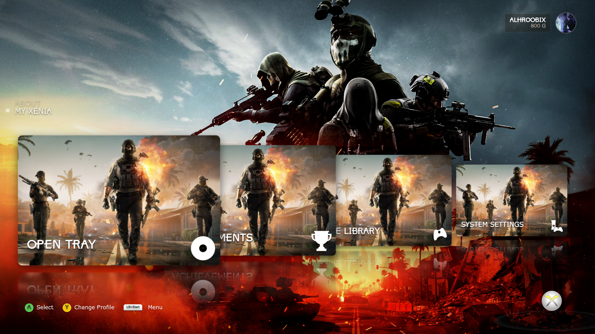
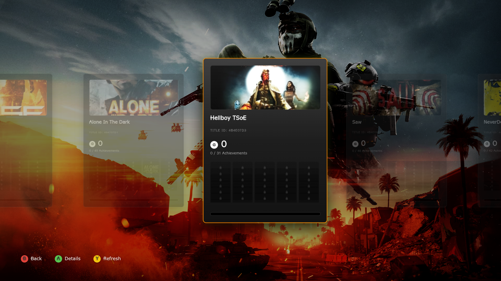
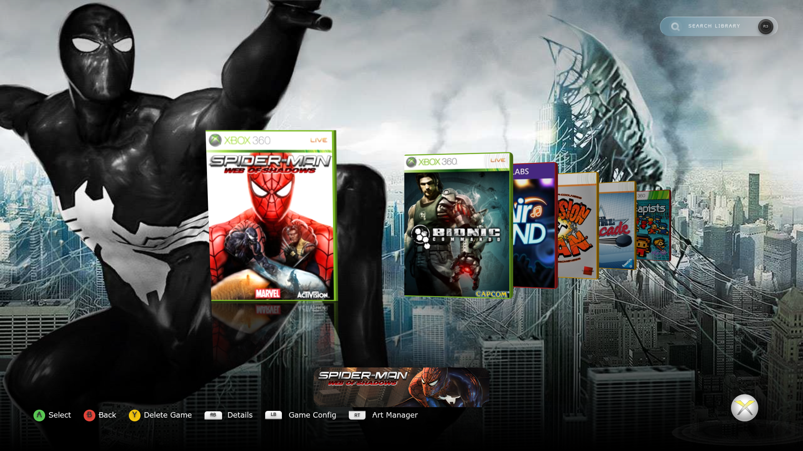

---

# Xenia Dashboard

واجهة أمامية متقدمة وغنية بالميزات لـ **مُحاكي Xenia Xbox 360**، صُممت لتقديم تجربة كلاسيكية بمستوى أجهزة ألعاب الفيديو على أجهزة الحاسوب الحديثة. تجسّر لوحة التحكم هذه الفجوة بين المحاكاة الخام ومكتبة الوسائط المنظمة والأنيقة.

---

  
  
  

  
---
<dev align="center">
<h3>Dashboard</h3>

<h3>Achievement</h3>

<h3>Game List</h3>

</dev>

---

واجهة أمامية متقدمة وغنية بالميزات لـ **مُحاكي Xenia Xbox 360**، صُممت لتقديم تجربة كلاسيكية بمستوى أجهزة ألعاب الفيديو على أجهزة الحاسوب الحديثة. تجسّر لوحة التحكم هذه الفجوة بين المحاكاة الخام ومكتبة الوسائط المنظمة والأنيقة.

---

# شكر خاص

## 🌟 رواد المحاكاة

يقف هذا المشروع على أكتاف العمالقة. شكر خاص لهذه المجتمعات الرائعة:

| المشروع | الوصف | الرابط |
| :--- | :--- | :---: |
| **Xenia Project** | أبحاث محاكي Xbox 360 الرئيسي | [🔗](https://github.com/xenia-project/xenia) |
| **Xenia Canary** | فرع تجريبي بميزات متقدمة | [🔗](https://github.com/xenia-canary/xenia-canary) |
| **Game Patches** | مستودع مجتمعي لإصلاحات الألعاب | [🔗](https://github.com/xenia-canary/game-patches) |
| **x360db** | مزود البيانات الوصفية الأساسية | [🔗](https://github.com/xenia-manager/x360db) |
| **SteamGridDB** | واجهة برمجة تطبيقات (API) لأغلفة الألعاب عالية الجودة | [🔗](https://www.steamgriddb.com/) |
| **Electron** | إطار العمل الأساسي لواجهة المستخدم الرسمية (GUI) | [🔗](https://www.electronjs.org/) |
| **Alpine.js** | إطار عمل JavaScript خفيف ومبسط | [🔗](https://github.com/alpinejs/alpine) |

## 🛠️ المكتبات والأدوات الأساسية

| المكتبة / الأداة | الغرض | الرابط |
|--------------|---------|------|
| **SDL** | إدخال أذرع التحكم وتجريد العتاد (Hardware Abstraction) | [🔗](https://www.libsdl.org/) |
| **x360tid** | الفحص الثنائي والتحقق من مُعرّف العنوان (Title ID) | [🔗](https://github.com/ALHROOBIX/x360tid) |
| **TOMKit** | إدارة ملفات إعدادات TOML | [🔗](https://github.com/python-poetry/tomlkit) |

---

  <h2>⚠️ إخلاء مسؤولية</h2>
  
<strong>هذا المشروع عبارة عن واجهة أمامية من طرف ثالث وليس له أي صلة بمشروع Xenia الرسمي أو شركة Microsoft.</strong>

---

## 🚀 Installation & Setup The themes | التثبيت وأعداد الثيم

| How to Install | طريقة التثبيت |
| :--- | ---: |
| 1. Download the theme file from the Releases tab. 2. Extract the `Themes` folder into the `systems` folder located inside your main **Xenia Dashboard** directory. 3. Launch the Xenia Dashboard program. 4. Go to **Settings > Themes**. 5. You will see the new theme there; select it to apply! | 
1. قم بتحميل ملف الثيم. 2. استخرج المجلد `Themes` بداخل مجلد `systems` الموجود في مسار برنامج **Xenia Dashboard** الأساسي. 3. قم بتشغيل برنامج Xenia Dashboard. 4. اذهب إلى **الإعدادات (Settings) > الثيمات (Themes)**. 5. سوف يظهر الثيم الجديد هناك، قم باختياره لتفعيله فوراً!
 |
 

| رابط التحميل |
|---------------|
| 🔗 [تحميل metro-2011](https://github.com/0xErrorVoid/Xenia-Dashboard-Metro-ui-Theme) |
| 🔗 [تحميل blade-2005](https://github.com/ALHROOBIX/Blades-2005-Theme-for-Xenia-Dashboard) |

<blockquote>
  💡 <b>Note:</b> Players can now design their own custom themes! You have full freedom to customize the Xenia Dashboard interface to your liking and share your creations with the community.  
  ⚠️ <b>Important Warning:</b> For your safety, only download and use themes from trusted creators and sources.
</blockquote>

  <blockquote>
    💡 <b>ملاحظة:</b> أصبح الآن بإمكان اللاعبين تصميم ثيماتهم (Themes) الخاصة بحرية تامة! يمكنك تخصيص واجهة Xenia Dashboard بالكامل لتناسب ذوقك، ومشاركة إبداعاتك مع مجتمع اللاعبين.  
    ⚠️ <b>تنبيه هام:</b> لضمان أمانك، لا تقم بتحميل أو استخدام أي ثيمات إلا من أشخاص ومصادر موثوقة.
  </blockquote>

---

## ✨ الميزات الرئيسية

### 🗂️ **إدارة ذكية للمكتبة**
- **فحص تلقائي للألعاب:** يكتشف صيغ `.iso` و `.xex` و `.zar` و `GOD` و `XBLA`.
- **تكامل أداة x360tid:** تحليل منخفض المستوى للتعرف الدقيق على مُعرّف العنوان (Title ID).
- **بيانات وصفية مزدوجة المصدر:** يجلب الصور والأغلفة من واجهة برمجة تطبيقات SteamGridDB أو من قاعدة البيانات المحلية.
- **تقارير التوافقية:** حالة التوافق المباشرة من متتبع التوافقية الرسمي لمُحاكي Xenia.

### ⚡ **تحسينات متقدمة للمُحاكي**
- **مدير إصلاحات (Patches) ديناميكي:** تنزيل وتثبيت وتفعيل/تعطيل إصلاحات الألعاب المخصصة.
- **إعدادات مخصصة لكل لعبة:** ملفات `.toml` منفصلة لكل مُعرّف عنوان (Title ID).
- **تحديثات بنقرة واحدة:** تحديثات تلقائية لـ Xenia Canary لنظامي Windows و Linux.
- **تخصيص عميق:** 13 منطقة ألوان، خلفيات مخصصة، وتخصيص كامل للثيمات.
- **صوتيات تفاعلية:** مؤثرات صوتية لواجهة المستخدم، أصوات التنقل، وموسيقى خلفية.
- **لوحة مفاتيح افتراضية:** لوحة مفاتيح بأسلوب Xbox 360 لميزة البحث.

---

# دليل هيكلة مجلدات الألعاب لـ XENIA DASHBOARD (XBLA & GOD)

---

## 1️⃣ ألعاب آركيد (XBLA)
تتميز ألعاب الآركيد بوجودها دائمًا داخل مجلد فرعي باسم `000D0000`.

**المسار الصحيح:**
`[Game ID] / 000D0000 / [Game File]`

* **مثال:** `58410846 / 000D0000 / B1234567890ABCDEF...`
* *ملاحظة:* يتكون ملف اللعبة من سلسلة طويلة من الحروف والأرقام العشوائية. **لا تقم بإعادة تسمية هذا الملف.**

---

## 2️⃣ ألعاب GOD (Games on Demand)
هذه هي النسخ الرقمية أو ألعاب الأقراص المحولة. وتوجد دائمًا داخل مجلد فرعي باسم `00007000`.

**المسار الصحيح:**
`[Game ID] / 00007000 / [Game File]`

* **مثال:** `4d5308d2 / 00007000 / C234567890ABCDEF1...`
* *ملاحظة:* بالإضافة إلى ملف اللعبة، قد تجد مجلدًا إضافيًا ينتهي بالامتداد `.data` بجوار الملف.

---

## 🔍 شرح المصطلحات
| المصطلح | الوصف |
| :--- | :--- |
| **Game ID** | مجلد فريد من 8 خانات (حروف وأرقام) يتكون منه معرف كل لعبة. |
| **000D0000** | المجلد المخصص لألعاب الآركيد والمحتويات القابلة للتنزيل (DLCs). |
| **00007000** | المجلد المخصص للألعاب الكاملة المحولة إلى صيغة GOD. |
| **Game File** | الملف الأساسي الذي يظهر بأحرف وأرقام عشوائية؛ إعادة تسميته تتسبب في تعطيل اللعبة. |

---

## 🎮 عناصر التحكم والتنقل

| مدخل التحكم | الإجراء |
|-------|---------|
| **D-Pad / العصي التحكمية** | التنقل في القوائم ولوحة المفاتيح |
| **(A) / Enter** | اختيار / تشغيل اللعبة |
| **R3** | تصفية الألعاب بالبحث |
| **(B) / Backspace** | الرجوع / إغلاق اللوحة |
| **(X)** | حفظ الإعدادات / إدارة الإصلاحات | 💾 |
| **(Y)** | حذف / إعادة ضبط / تحديث / تغيير الصورة الشخصية |
| **(LB) / (L)** | فتح الإعدادات المخصصة للعبة الحالية |
| **(RB) / (R)** | إظهار/إخفاء معلومات اللعبة | ℹ️ |
| **Tab / (Start+LB)** | فتح واجهة دليل Xenia المنبثقة |
| **LT** | ترجمة الوصف إلى اللغة العربية |
| **L3 أو Z** | فحص ألعاب `.zar` للتعرف على Title ID |

---

## 🚀 بداية الاستخدام

### 1. **التثبيت والبيئة**
- **Windows:** قم بتنزيل `Xenia Dashboard.exe`
- **Linux:** قم بتنزيل `Xenia Dashboard.AppImage`
- **المسار:** ضعه في مجلد مخصص يتضمن صلاحيات الكتابة (تجنب مجلد *Program Files*)

### 2. **الإعدادات الأساسية**
1. قم بتشغيل التطبيق
2. انتقل إلى **Core Settings**
3. حدد **Xenia Path** بالإشارة إلى ملف `xenia_canary.exe` الخاص بك (يمكنك استخدام التنزيل المدمج إن لزم الأمر)
4. حدد **Game Folder** بالإشارة إلى مجلد الألعاب لديك
5. اختر **Metadata Source** مصدر البيانات الوصفية (SteamGridDB أو قاعدة البيانات المحلية)

### 3. **الفحص الأولي للمكتبة**
- يبدأ الفحص التلقائي فور تحديد المسارات
- للألعاب غير المكتشفة: اضغط على **(Back)** على بطاقة اللعبة لإجراء فحص ثنائي عميق

### 4. **تخصيص التجربة**
- عدّل الألوان من قائمة **Interface Colors**
- فعّل إعدادات الصوت وقم بإعدادها في **Sound Settings**

## 📥 تحميل Xenia Dashboard

| المنصة | التحميل |
|----------|----------|
| **Windows** |  |
| **Linux** |  |

---

## 🛠️ نظرة عامة تقنية

- **البنية الهيكلية:** قائمة على Electron للتوافقية عبر مختلف المنصات
- **الواجهة الأمامية:** Alpine.js لواجهة مستخدم خفيفة وسريعة الاستجابة
- **التخزين:** electron-store للإعدادات والحفظ الدائم
- **الإدخال:** مكتبة SDL للتنقل الدقيق باستخدام أذرع التحكم

---

## 💖 دعم العمل

إذا كنت تستمتع باستخدام Xenia Dashboard، ففكر في دعم تطوير المشروع!

---

