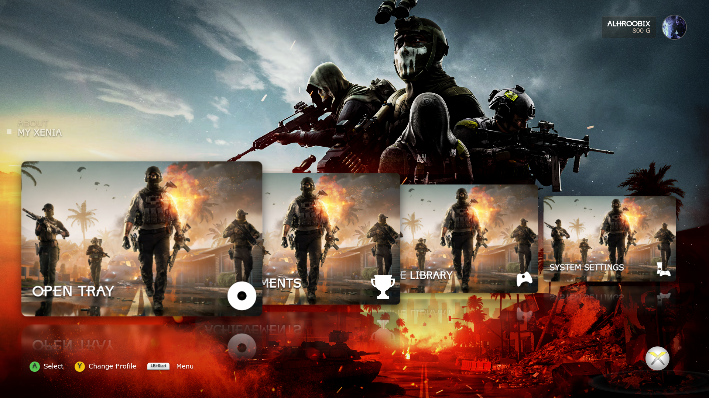
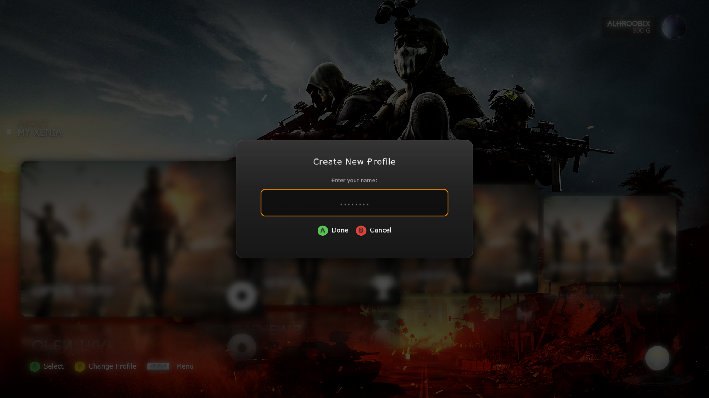
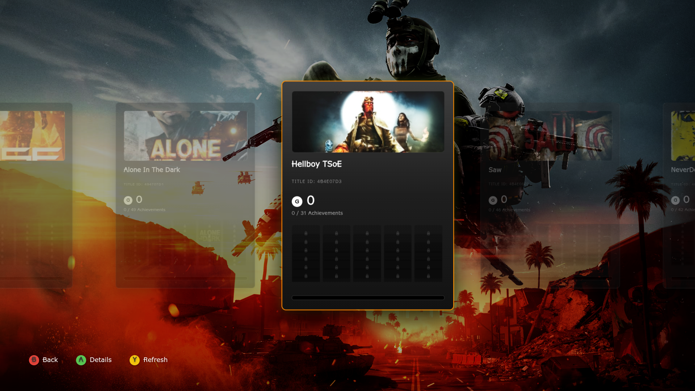
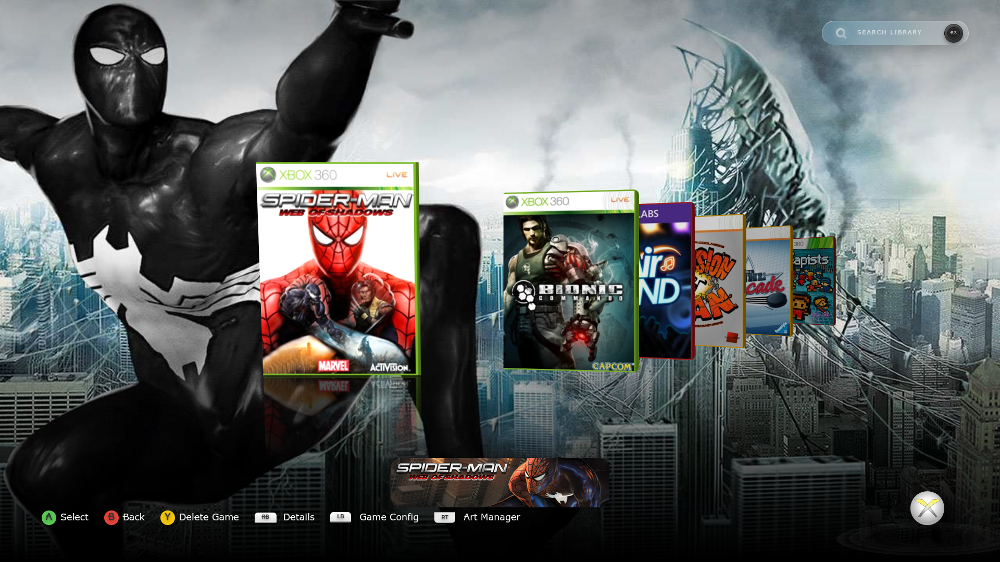
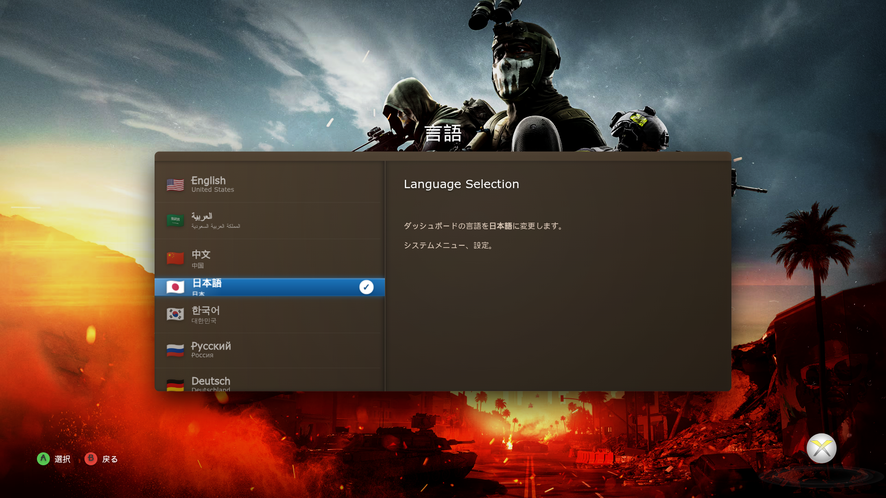
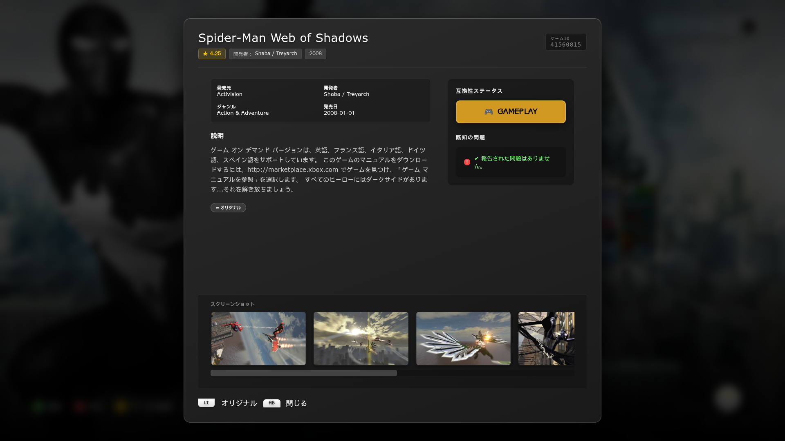
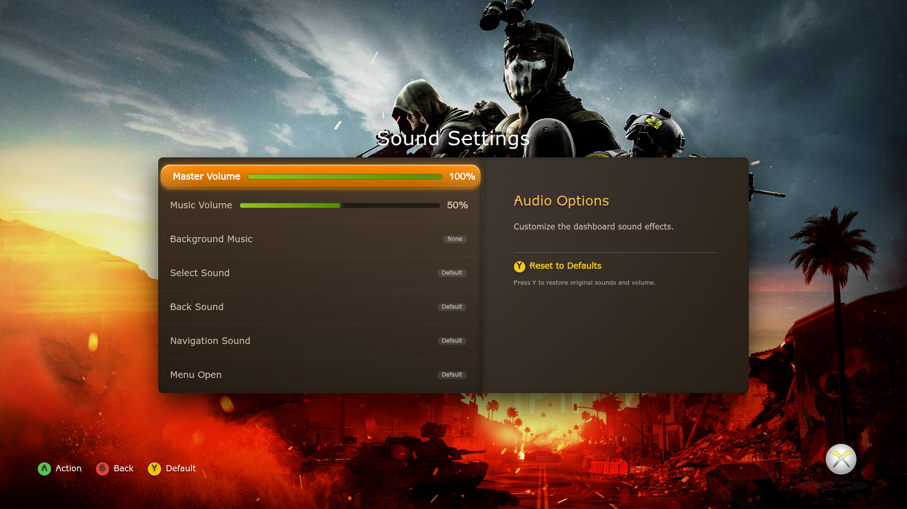
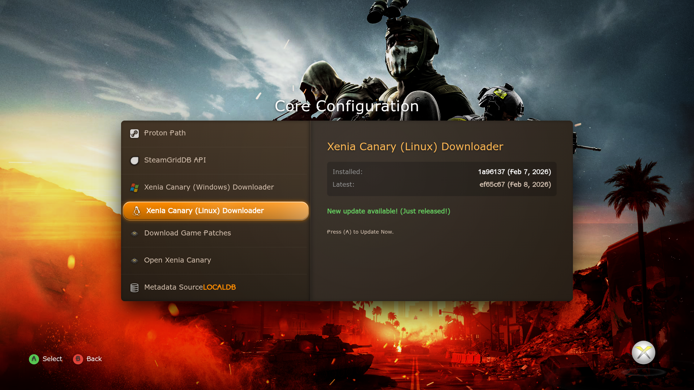

---

# Xenia Dashboard

An advanced, feature-rich frontend for the **Xenia Xbox 360 Emulator**, designed to provide a nostalgic, console-grade experience on modern PCs. This dashboard bridges the gap between raw emulation and a polished media library.


<p align="center">
  <a href ="https://github.com/ALHROOBIX/Xenia-Dashboard/releases/latest"> </a>
  <a href ="https://github.com/ALHROOBIX/Xenia-Dashboard/releases/latest"> </a>
  </p>

---
## Image Gallery with Details

| Image | Screenshot | Details | Status |
|-------|------------|---------|--------|
| **Dashboard** |  |Dashboard for gaming system with settings, library, tray, and profile options. Includes Select and Menu navigation.| ✅ Active |
|Switch User| |The user can switch between users|✅ Active|
|Create New Profile||Create new profiles for xenia canary|✅ Active|
|Achievement||You can view the achievements you've earned in games|✅ Active|
|Game List||The game library uses color: <br><br> <span style="color:green">Green</span> for disc files (ISO/XEX/ZAR). <br><br> <span style="color:red">Red</span> for GOD digital downloads. <br><br> <span style="color:orange">Orange</span> for Xbox Live Arcade (XBLA) titles.|✅ Active|
|Language||You can now switch between different languages. <span style="color:red">Note: The flag logo appears only in the Linux version.</span>|✅ Active|
|Translate game detels||You can now translate game details according to the application's selected language.|✅ Active|
|Sounds Setting||You can fully customize the audio configuration within the Xenia dashboard|✅ Active|
|Download xenia canary||You can download Xenia Canary for either Windows or Linux versions, identify the latest release, and it will automatically detect its installation path after download.|✅ Active|

---

# Special Thanks


<div align="center">
  <h3>🎮 The Ultimate Frontend for Xenia Canary Emulator 🎮</h3>
  <p><i>Transforming emulation into a polished, accessible experience</i></p>
</div>

---

## 🌟 The Emulation Pioneers

This project stands on the shoulders of giants. Special thanks to these incredible communities:

<div align="center">

| Project | Description | Link |
|---------|-------------|------|
| **Xenia Project** | Mainline Xbox 360 Emulator Research | [🔗](https://github.com/xenia-project/xenia) |
| **Xenia Canary** | Experimental fork with advanced features | [🔗](https://github.com/xenia-canary/xenia-canary) |
| **Game Patches** | Community repository for game fixes | [🔗](https://github.com/xenia-canary/game-patches) |
| **x360db** | Essential metadata provider | [🔗](https://github.com/xenia-manager/x360db) |
| **SteamGridDB** | High-quality game covers API | [🔗](https://www.steamgriddb.com/) |
| **Electron** | Core framework for GUI | [🔗](https://www.electronjs.org/) |
| **Alpine.js** | Minimal JavaScript framework | [🔗](https://github.com/alpinejs/alpine) |

</div>

## 🛠️ Core Libraries & Tools

<div align="center">

| Library/Tool | Purpose | Link |
|--------------|---------|------|
| **SDL** | Controller input and hardware abstraction | [🔗](https://www.libsdl.org/) |
| **abgx360** | Binary scanning & Title ID verification | [🔗](https://github.com/BakasuraRCE/abgx360) |
| **TOMKit** | TOML configuration management | [🔗](https://github.com/python-poetry/tomlkit) |

</div>

> **📝 Note:** The **abgx360** tool is an external, independent utility and is not affiliated with this project. It is used solely as a third-party scanning engine to improve the accuracy of game identification.

---

<div align="center">
  <h2>⚠️ Disclaimer</h2>
  <p><strong>This project is a third-party frontend and is not affiliated with the official Xenia Project or Microsoft.</strong></p>
</div>

---

## 🎯 About Xenia Dashboard

> Designed to bridge the gap between emulator and user, this specialized interface transforms Xenia Canary into a polished, accessible platform with robust control and effortless library management.

---

## ✨ Key Features

### 🗂️ **Intelligent Library Management**
- **Automated Game Scanning:** Detects `.iso`, `.xex`, `.zar`, `GOD`, and `XBLA` files
- **abgx360 Integration:** Low-level analysis for accurate Title ID identification
- **Dual-Source Metadata:** Fetches artwork from SteamGridDB API or local database
- **Compatibility Reports:** Real-time status from official Xenia compatibility tracker

### ⚡ **Advanced Emulator Optimization**
- **Dynamic Patch Manager:** Download, install, and toggle game-specific patches
- **Per-Game Configuration:** Unique `.toml` files for individual Title IDs
- **One-Click Updates:** Automatic Xenia Canary updates for Windows and Linux
- **Deep Personalization:** 13 color zones, custom wallpapers, and theme customization
- **Immersive Audio:** UI sound effects, navigation sounds, and background music
- **Virtual Keyboard:** Xbox 360-style keyboard for search functionality

---

## 📥 Download abgx360

<p align="center">
  <strong>Essential for accurate game identification</strong>
</p>

<div align="center">

| Platform | Download Link | Release Name |
|----------|---------------|--------------|
| **Windows** | [Download](https://www.hadzz.com/abgx/download.php) | `CLI - abgx360_v1.0.7_cli.zip` |
| **Linux** | [Download](https://www.hadzz.com/abgx/download.php) | `CLI - abgx360-1.0.7.tar.gz` |

</div>

### 🐧 Linux Installation Instructions

```bash
# Step 1: Install dependencies
sudo apt-get install libcurl4-openssl-dev zlib1g-dev

# Step 2: Compile and install
./configure
make
sudo make install
```

---

## 🎮 Controls & Navigation

<div align="center">

| Input | Action |
|-------|---------|
| **D-Pad / Sticks** | Navigate Menus & Keyboard |
| **(A) / Enter** | Select / Launch Game |
| **R3** | Search filter games |
| **(B) / Backspace** | Go Back / Close Panel |
| **(X)** | Save Config / Manage Patches | 💾 |
| **(Y)** | Delete / Reset / Update / Change Avatar |
| **(LB) / (L)** | Open Per-Game Configuration |
| **(RB) / (R)** | Toggle Game Info | ℹ️ |
| **Tab / (Start+LB)** | Open Xenia Guide Overlay |
| **LT** | Translate description to Arabic |
| **L3 or Z** | Scan `.zar` games for Title ID |

</div>

---

## 🚀 Getting Started

### 1. **Installation & Environment**
- **Windows:** Download `Xenia Dashboard.exe`
- **Linux:** Download `Xenia Dashboard.AppImage`
- **Location:** Place in a dedicated folder with write permissions (avoid *Program Files*)

### 2. **Core Configuration**
1. Launch the application
2. Navigate to **Core Settings**
3. Set **Xenia Path** to your `xenia_canary.exe` (use built-in download if needed)
4. Set **Game Folder** to your game directory
5. Choose **Metadata Source** (SteamGridDB or Local Database)

### 3. **Initial Library Scan**
- Automatic scan begins when paths are set
- For unrecognized games: Press **(Back)** on game tile for deep binary scan

### 4. **Customizing Your Experience**
- Modify colors in **Interface Colors** menu
- Enable/configure audio in **Sound Settings**

---

## 📥 Download Xenia Dashboard

<div align="center">

| Platform | Download |
|----------|----------|
| **Windows** | [](https://github.com/ALHROOBIX/Xenia-Dashboard/releases/latest) |
| **Linux** | [](https://github.com/ALHROOBIX/Xenia-Dashboard/releases/latest) |

</div>

---

## 🛠️ Technical Overview

- **Architecture:** Electron-based for cross-platform compatibility
- **Frontend:** Alpine.js for responsive, lightweight UI
- **Storage:** electron-store for persistent configurations
- **Input:** SDL library for precise gamepad navigation

---

## 💖 Support My Work

<div align="center">

<p>If you enjoy using Xenia Dashboard, consider supporting development!</p>

[](https://ko-fi.com/alhroobixi)

</div>

---
