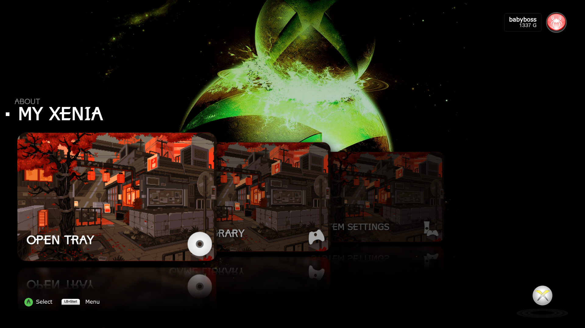
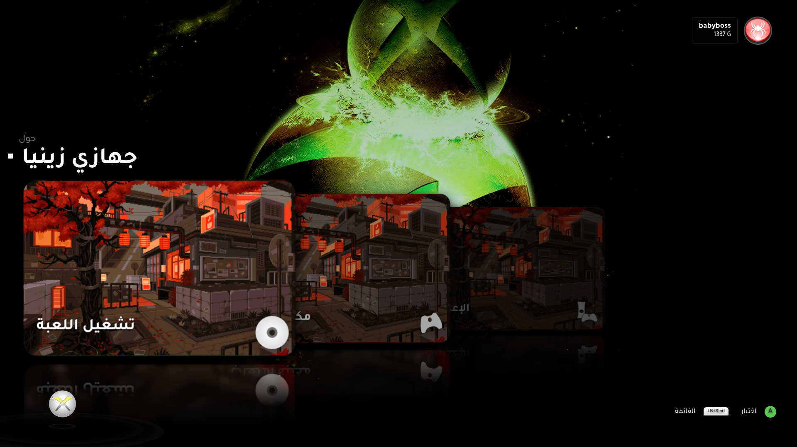

---

# Xenia Dashboard

> An advanced, feature-rich frontend for the **Xenia Xbox 360 Emulator**, designed to provide a nostalgic, console-grade experience on modern PCs. This dashboard bridges the gap between raw emulation and a polished media library.

---




---

## Credits & Special Thanks

The **Xenia Dashboard** stands on the shoulders of giants. This project is made possible thanks to the hard work of these communities:

### **The Emulation Pioneers**

1. [Xenia Project](https://github.com/xenia-project/xenia): The mainline Xbox 360 Emulator Research Project.
2. [Xenia Canary](https://github.com/xenia-canary/xenia-canary): The experimental fork that pushes the boundaries of performance and features.
3. [Game Patches](https://github.com/xenia-canary/game-patches): The community repository for vital game fixes and enhancements.
4. [xenia-manager/x360db](https://github.com/xenia-manager/x360db) Thanks to the x360db and Xenia Manager teams for providing the essential metadata that power this project.
5. [steamgriddb](https://www.steamgriddb.com/) Special thanks to SteamGridDB for their API contribution in providing the high-quality game covers for this project.
6. [Electron](https://www.electronjs.org/) Grateful for Electron's contribution in providing the core framework for this software's GUI.
7. [Alpinejs](https://github.com/alpinejs/alpine) Grateful for Alpine.js for providing the rugged, minimal framework used to compose JavaScript behavior directly within this project's markup.

### **Core Libraries & Tools**

1. [SDL (Simple DirectMedia Layer)](https://www.libsdl.org/): Used for high-performance controller input and hardware abstraction.
2. [abgx360](https://github.com/BakasuraRCE/abgx360): Used for low-level binary scanning and Title ID verification.
3. [TOMKit](https://github.com/python-poetry/tomlkit) Grateful for tomkit's contribution as the style-preserving TOML library used to manage Xenia Canary configuration files in this project.
      

> **Note:** The **abgx360** tool is an external, independent utility and is not affiliated with this project. It is used solely as a third-party scanning engine to improve the accuracy of game identification.

---

**Disclaimer:** This project is a third-party frontend and is not affiliated with the official Xenia Project or Microsoft.

## About

> Designed to bridge the gap between emulator and user, this specialized interface transforms Xenia Canary into a polished, accessible platform with robust control and effortless library management.

---

## Key Features

---

### **1. Intelligent Library Management**

* **Automated Game Scanning:** Automatically detects and catalogs `.iso` and `.xex` files from your designated game folder.

* **abgx360 Integration:** Utilizes the `abgx360` binary to perform low-level analysis for accurate Title ID identification.

---

> for the Download **abgx360** you must Download this **release** Name:

* **Windows:** `CLI - abgx360_v1.0.7_cli.zip`
* **Linux:** `CLI - abgx360-1.0.7.tar.gz`

---

 **abgx360 Link to Download:**

| Windows                                         | Linux                                           |
|:----------------------------------------------- |:----------------------------------------------- |
| [Link](https://www.hadzz.com/abgx/download.php) | [Link](https://www.hadzz.com/abgx/download.php) |

> **Note:** When downloading **abgx360** for Linux, you must build it using this command:

---

**step-1**

```bash
# To install them on systems with apt-get:
sudo apt-get install libcurl4-openssl-dev zlib1g-dev
```

**step-2**

```bash
#To compile and install abgx360:
./configure
make
sudo make install
```

* **Dual-Source Metadata:** Fetches high-quality game covers and logos from the **SteamGridDB API** or a comprehensive **Local JSON database** (`x360db_titles_merged.json`).

* **Compatibility Reports:** Displays real-time compatibility status (e.g., Playable, Gameplay) by fetching data from the official Xenia compatibility tracker.

### **2. Advanced Emulator Optimization**

* **Dynamic Patch Manager:** Provides a robust interface to download, install, and toggle game-specific patches like 60FPS unlocks or resolution boosts.

* **Per-Game Configuration:** Automatically creates and applies unique `.toml` configuration files for individual Title IDs to optimize performance.

* **One-Click Updates:** Monitors GitHub for the latest **Xenia Canary** releases and handles the download and installation for Windows and Linux.

* **Deep Personalization:** Modify 13 distinct color zones, set custom wallpapers, and configure "stage" flourishes to create your own theme.

* **Immersive Audio:** Includes original UI sound effects, customizable navigation sounds, and background music support.

* **Virtual Keyboard:** Navigable Xbox 360-style virtual keyboard for search in game library.

---

## Technical Overview

* **Architecture:** Developed using **Electron** to ensure cross-platform compatibility on Windows and Linux.
* **Frontend:** Built with **Alpine.js** for a responsive and lightweight user interface.
* **Storage:** Uses **electron-store** for persistent user configurations and metadata caching.
* **Input:** Integrated controller support with a dedicated SDL library for precise gamepad navigation.

---

## 🎮 Controls & Navigation

| Input                  | Action                                                |
|:---------------------- |:----------------------------------------------------- |
| **D-Pad / Sticks**     | Navigate Menus and Virtual Keyboard                   |
| **(A) / Enter**        | Select / Launch Game                                  |
| **(B) / Backspace**    | Go Back / Close Panel                                 |
| **(X)**                | Save Config / Manage Patches                          |
| **(Y)**                | Delete Selection / Reset Settings / Check for Updates / Change profile picture |
| **(LB) / (L)**         | Open Per-Game Configuration                           |
| **(RB) / (R)**         | Toggle Detailed Game Information / and close          |
| **Tab / (Start + LB)** | Open Xenia Guide Overlay                              |
| **LT**                 | Translate description game to arabic                  | 

---

## Getting Started

Follow these steps to set up the **Xenia Dashboard** and transform your emulation experience.

### 1. Installation & Environment

The application is built for portability. Simply download the version corresponding to your operating system:

* **Windows:** Download the `Xenia Dashboard.exe`.
* **Linux:** Download the `Xenia Dashboard.AppImage`.
* **Location:** Place the file in a dedicated folder (e.g., `your/path\XeniaDashboard`). Avoid restricted system folders like *Program Files* to ensure the app has full write permissions.

### 2. Core Configuration

Upon the first launch, navigate to **Core Settings** to link your essential files:

* **Xenia Path:** Select your `xenia_canary.exe` (or Linux binary). If you don't have it, use the built-in **Download Xenia** button to fetch the latest release automatically.
* **Game Folder:** Point the dashboard to the directory where your `.iso` and `.xex` games are stored.
* **Metadata Source:** Choose between **SteamGridDB** (requires an API Key) or the **Local Database** for fetching artwork.

### 3. Initial Library Scan

Once your paths are set, return to the **Game Library**. The dashboard will automatically begin its first scan:

* **Automatic Match:** The system will attempt to identify games based on filenames and internal headers.
* **Deep Scan (Optional):** If a game isn't recognized, press **(Back)** or **(Backspace)** on the game tile to perform a deep binary scan using `abgx360` for 100% accuracy.

### 4. Customizing Your Experience

* **Colors:** Use the **Interface Colors** menu to modify brand colors or create a custom theme from scratch.
* **Audio:** Enable background music or customize navigation sounds in **Sound Settings**.

---

## Download

| Build   | Releases      |
|:------- |:------------- |
| Windows | [download](https://github.com/ALHROOBIX/Xenia-Dashboard/releases/) |
| Linux   | [download](https://github.com/ALHROOBIX/Xenia-Dashboard/releases/) |

---

### Support My Work

If you enjoy using the Xenia Dashboard, consider supporting development via Ko-fi!

[](https://ko-fi.com/alhroobixi)

---

> **Author:** ALHROOBIX  
> **License:** MIT
